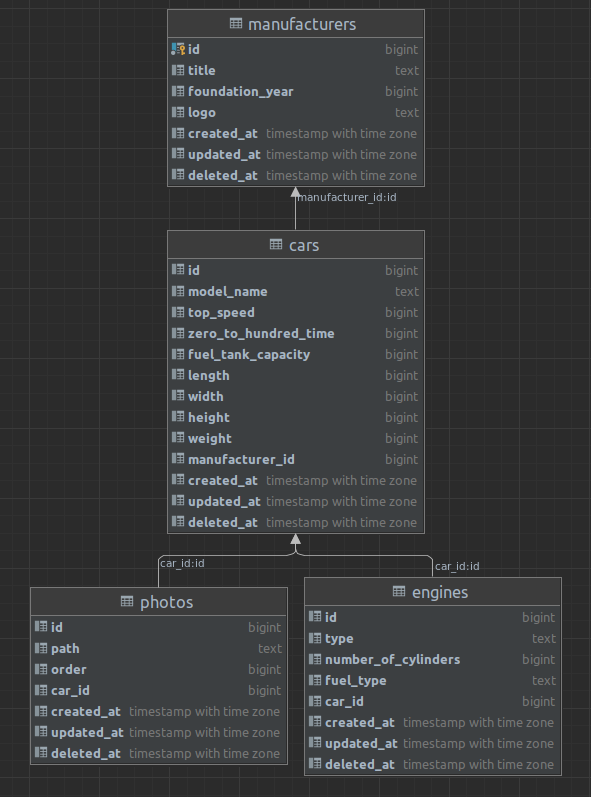

## Database structure:



## Relations and completion of them:

* Manufacturer
    * has many cars ✔

* Car
    * belongs to a manufacturer ✔
    * has one engine ✔
    * has many photos ✔

* Photo
    * belongs to a car ✔

* Engine
    * belongs to a car ❌

## Endpoints:

You can find request bodies to specific endpoints under the table.

| HTTP Method | URI                                                        | Action                                    |
|-------------|:-----------------------------------------------------------|-------------------------------------------|
| -----       | **Manufacturers**                                          | -----                                     |
| GET         | /manufacturers                                             | Get all the manufacturers                 |
| 1. POST     | /manufacturers                                             | Create a manufacturer                     |
| GET         | /manufacturers/:manufacturerID                             | Get a manufacturer                        |
| 2. PUT      | /manufacturers/:manufacturerID                             | Update a manufacturer                     |
| DELETE      | /manufacturers/:manufacturerID                             | Delete a manufacturer                     |
| -----       | **Cars of the manufacturer**                               | -----                                     |
| GET         | /manufacturers/:manufacturerID/cars                        | Get all the cars of the manufacturer      |
| 3. POST     | /manufacturers/:manufacturerID/cars                        | Create a car under the manufacturer       |
| GET         | /manufacturers/:manufacturerID/cars/:carID                 | Get a car of the manufacturer             |
| 4. PUT      | /manufacturers/:manufacturerID/cars/:carID                 | Update a car of the manufacturer          |
| DELETE      | /manufacturers/:manufacturerID/cars/:carID                 | Delete a car of the manufacturer          |
| -----       | **Engine of the car**                                      | -----                                     |
| 5. POST     | /manufacturers/:manufacturerID/cars/:carID/engine          | Create an engine under the car            |
| GET         | /manufacturers/:manufacturerID/cars/:carID/engine          | Get an engine of the car                  |
| 6. PUT      | /manufacturers/:manufacturerID/cars/:carID/engine          | Update an engine of the car               |
| DELETE      | /manufacturers/:manufacturerID/cars/:carID/engine          | Delete an engine of the car               |
| -----       | **Photos of the car**                                      | -----                                     |
| GET         | /manufacturers/:manufacturerID/cars/:carID/photos          | Get all the photos of the car             |
| 7. POST     | /manufacturers/:manufacturerID/cars/:carID/photos          | Upload a photo to the car                 |
| 8. PUT      | /manufacturers/:manufacturerID/cars/:carID/photos/orders   | Update the order of the photos of the car |
| DELETE      | /manufacturers/:manufacturerID/cars/:carID/photos/:photoID | Delete a photo of the car                 |

##Request bodies for numbered endpoints above:

1. Create a manufacturer

```
{
    "title": "BMW",
    "foundation_year": 1916,
    "logo": "https://upload.wikimedia.org/wikipedia/commons/f/f4/BMW_logo_%28gray%29.svg"
}
```

2. Update a manufacturer

```
{
    "title": "BMW",
    "foundation_year": 1916,
    "logo": "https://upload.wikimedia.org/wikipedia/commons/thumb/4/44/BMW.svg/2048px-BMW.svg.png"
}
```

3. Create a car under the manufacturer

```
{
    "model_name": "BMW E34 5 Series 525td",
    "top_speed": 194,
    "zero_to_hundred_time": 12900,
    "fuel_tank_capacity": 80000,
    "length": 4720,
    "width": 1751,
    "height": 1412,
    "weight": 1465000
}
```
My choice:
* _Speed is in kilometers/hour_
* _Time is in milliseconds_
* _Capacity is in milliliters_
* _Length, width and height are in millimeters_
* _Weight is in milligrams_
* _Information about the cars was obtained from the https://www.ultimatespecs.com_

You can use the app as you want. Use any units you prefer.

4. Update a car of the manufacturer

```
{
    "model_name": "BMW E34 5 Series 525td",
    "top_speed": 194,
    "zero_to_hundred_time": 12900,
    "fuel_tank_capacity": 80000,
    "length": 4720,
    "width": 1751,
    "height": 1412,
    "weight": 1465000
}
```

5. Create an engine under the car

```
{
    "type": "Inline",
    "number_of_cylinders": 6,
    "fuel_type": "Diesel"
}
```

6. 	Update an engine of the car

```
{
    "type": "Inline",
    "number_of_cylinders": 6,
    "fuel_type": "Petrol"
}
```

7. Upload a photo to the car (form-data)

```
{
    "photo": uploaded file in form-data
}
```

8. Update the order of the photos of the car

```
{
    "photos_ids": [
        12,
        10,
        9,
        11
    ]
}
```
